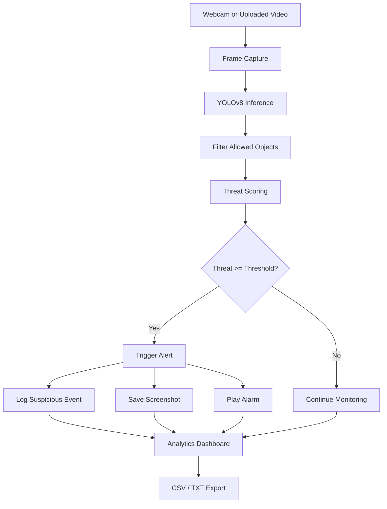
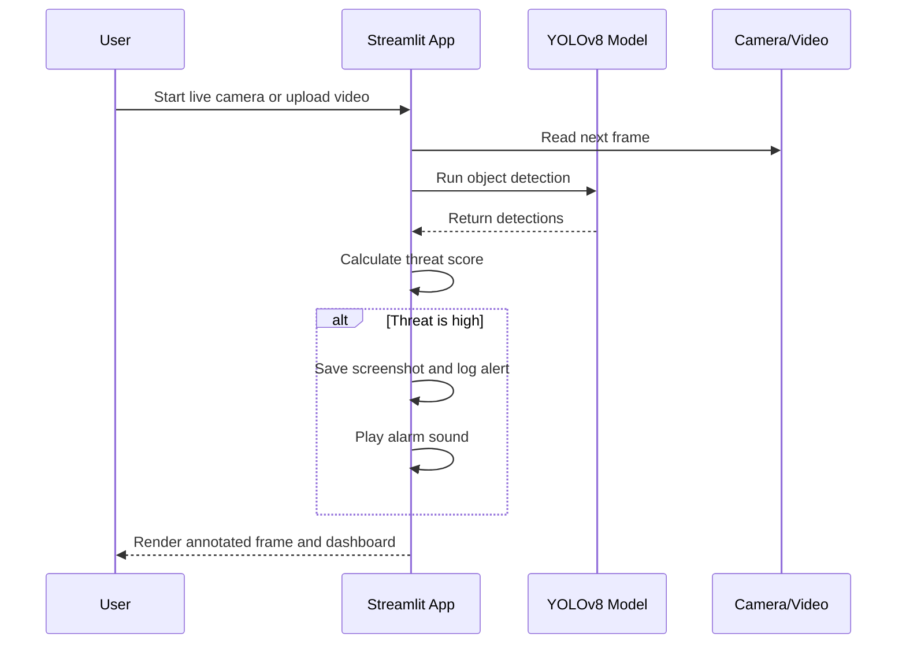
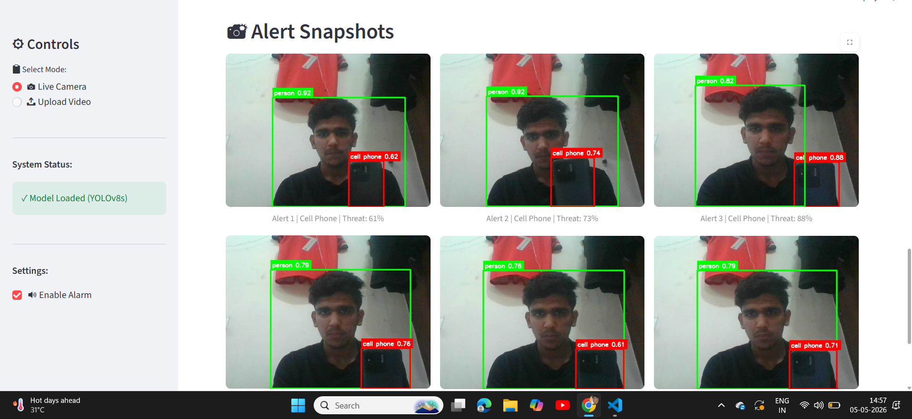
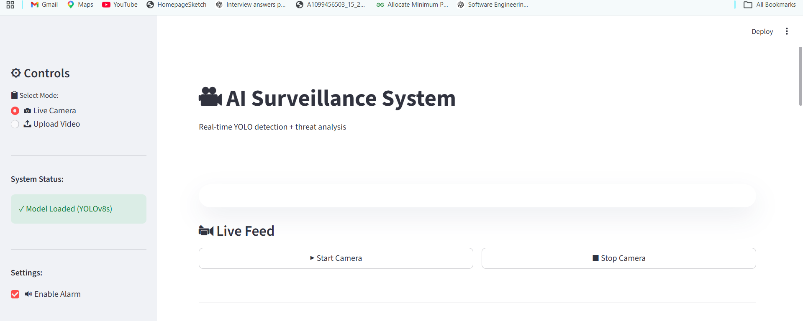
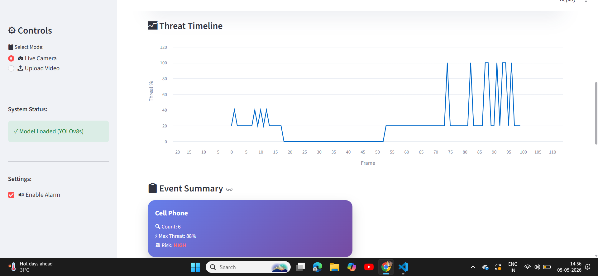
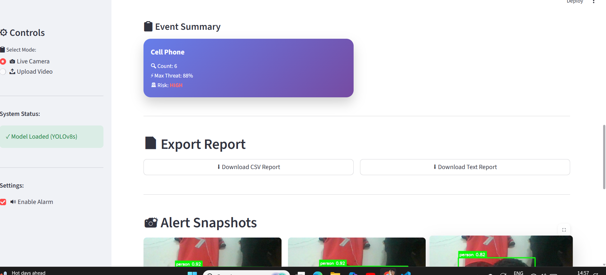

# AI Surveillance System

<div align="center">

[](#local-setup)


Real-time AI surveillance for live camera or uploaded video. The app detects selected objects, scores threat levels, triggers alerts, captures screenshots, records video, and generates exportable reports.

Repository: [AI-Surveillance-System](https://github.com/ManikantaPerla07/AI-Surveillance-System)

</div>

## Table of Contents

- [Overview](#overview)
- [Feature Highlights](#feature-highlights)
- [How It Works](#how-it-works)
- [Architecture](#architecture)
- [Architecture Diagram](#architecture-diagram)
- [Screenshots](#screenshots)
- [Tech Stack](#tech-stack)
- [Project Structure](#project-structure)
- [Run Locally](#run-locally)
- [Configuration Notes](#configuration-notes)
- [Troubleshooting](#troubleshooting)
- [Roadmap](#roadmap)
- [Author](#author)

## Overview

AI Surveillance System is a Streamlit-based monitoring dashboard that uses YOLOv8 to detect selected objects in real time from a webcam or uploaded video. It is designed to surface suspicious activity through threat scoring, visual alerts, screenshots, recorded video, and downloadable reports.

## Feature Highlights

- Real-time object detection with bounding boxes.
- Threat scoring with Safe, Medium, and High risk states.
- Automatic alert generation with optional sound.
- Screenshot capture when a threat spike is detected.
- Session video recording with download support.
- Threat timeline analytics and event summaries.
- CSV and TXT report export.
- Browser webcam, local camera, and uploaded video workflows.

## How It Works

1. The app reads frames from the default camera or from an uploaded video file.
2. YOLOv8 detects objects in each frame.
3. The app filters detections to allowed classes and calculates a threat score.
4. If the score crosses the alert threshold, the system logs the event, saves a screenshot, and can play an alarm.
5. The Streamlit UI shows annotated frames, analytics, and report controls.

## Architecture

The app follows a simple capture, detect, score, alert, and report pipeline.

## Architecture Diagram





## Screenshots

Current screenshots are stored in the `screenshots/` folder.

### Live Detection



### Dashboard



### Threat Timeline


### Event Summary



### Export Report



### Alert Snapshots


## Tech Stack

- Python 3.11+
- Streamlit
- Ultralytics YOLOv8
- OpenCV
- NumPy
- Pandas
- scikit-learn

## Project Structure

```text
.
├── app.py
├── core.py
├── utils.py
├── generate_alarm.py
├── requirements.txt
├── README.md
├── alarm.wav
├── screenshots/
└── test_yolo.py
```

## Run Locally

### 1. Clone the repository

```bash
git clone https://github.com/ManikantaPerla07/AI-Surveillance-System.git
cd AI-Surveillance-System
```

### 2. Install dependencies

```bash
pip install -r requirements.txt
```

### 3. Start the app

```bash
streamlit run app.py
```

### 4. Open the app

Streamlit will print a local URL in the terminal, usually:

```text
http://localhost:8501
```

## Usage Guide

### Browser Webcam Mode

- Choose `Browser Webcam` in the sidebar.
- Click `Start` in the Streamlit WebRTC widget and allow camera access in the browser.
- Review the annotated stream, threat score, alerts, screenshots, and analytics.
- Click `Stop` to end the session.

### Local Camera Mode

- Choose `Local Camera` in the sidebar.
- Click `Start Camera` to begin monitoring from the machine running Streamlit.
- Use this only when the app is running on a device that physically has the camera attached.

### Upload Video Mode

- Choose `Upload Video` in the sidebar.
- Upload an MP4, AVI, MOV, or MKV file.
- Click `Analyze` to process the video.
- Export reports once processing completes.

## Outputs

During a session, the app may create:

- Annotated frame previews inside the UI.
- `output.avi` recorded session video.
- Alert screenshots under `screenshots/`.
- CSV report export.
- TXT report export.

## Configuration Notes

- The model is loaded automatically from `yolov8s.pt` on first run.
- Windows users can hear the alarm sound through `winsound`.
- The browser webcam mode is the deployment-safe option and should be used on Streamlit Cloud.
- The local camera mode uses webcam index `0` and is only for machines that physically have the camera attached.
- The first startup may take longer while the model is downloaded.

## Troubleshooting

- If the camera does not open, close other apps that may be using the webcam.
- If the model fails to load, confirm that `ultralytics` is installed and the machine can reach the internet for the first download.
- If Streamlit does not open automatically, manually visit `http://localhost:8501`.

## Roadmap

- Multi-camera support.
- Face recognition.
- Cloud deployment.
- Mobile notifications.
- Role-based access and audit logs.

## Author

Manikanta Perla
